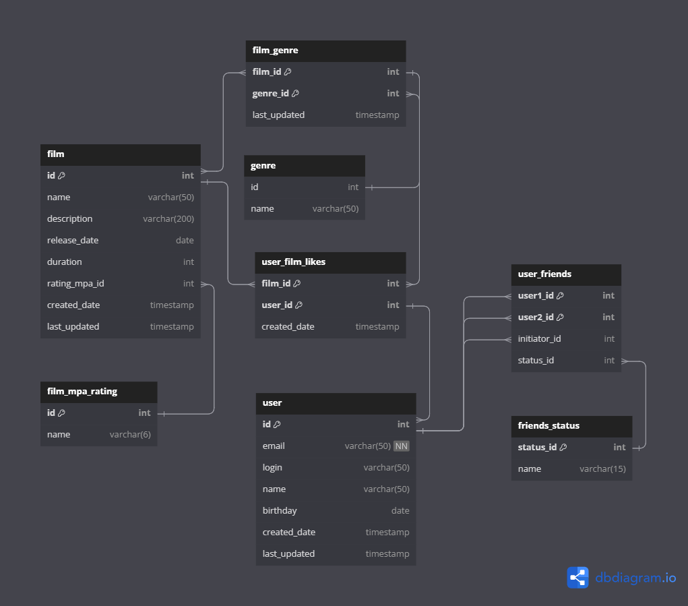

# Проект базы данных фильмов

## Фильмы
#### База фильмов с параметрами и возможностью фиксации лайков пользователей.
#### У фильма может быть сразу несколько жанров, а у поля — несколько значений.
#### Эта оценка определяет возрастное ограничение для фильма.

## Пользователи
#### Содержат данные пользователей, которые могут добавлять друг друга в друзья.
#### При добавлении в друзья есть статусы
- `неподтверждённая` — когда один пользователь отправил запрос на добавление другого пользователя в друзья,
- `подтверждённая` — когда второй пользователь согласился на добавление.

> База данных сформирована на сайте QuickDBD и доступна по ссылке
> 
> [Перейти](https://app.quickdatabasediagrams.com/#/d/CAk39h)


[Посмотреть в файле *.png](main/resources/images/DB_Filmorate.png)


## Базовые запросы
- #### Получить список фильмов отсортированных по дате релиза
```roomsql
SELECT film.name,
       CAST(release_date AS date)
FROM film
ORDER BY CAST(release_date AS date) DESC; 
```


- #### Получить список фильмов отсортированных по дате за выбранный период
```roomsql
SELECT CAST(invoice_date AS date),
       SUM(total)
FROM film
WHERE CAST(release_date AS date) between '2022-01-01' AND '2023-01-01'
ORDER BY CAST(release_date AS date) DESC; 
```

- #### Получить имена, логины и email пользователей c необходимым лимитом
```roomsql
SELECT user.name,
       user.email,
       user.login
FROM user
LIMIT 10;
```

- #### Получить количество друзей пользователей
```roomsql
SELECT name, 
       t.friends_count 
FROM user
JOIN (
SELECT product_id, 
       count(*) AS friends_count
FROM user_friends
GROUP BY product_id
) AS f
ON user.user_id = f.user1_id;
```